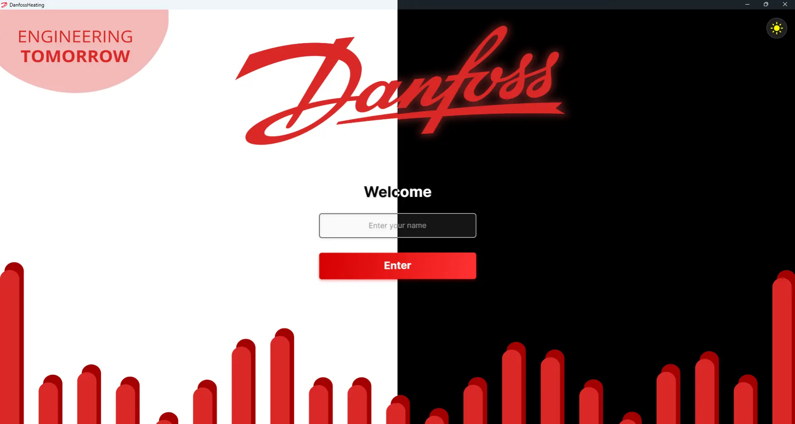
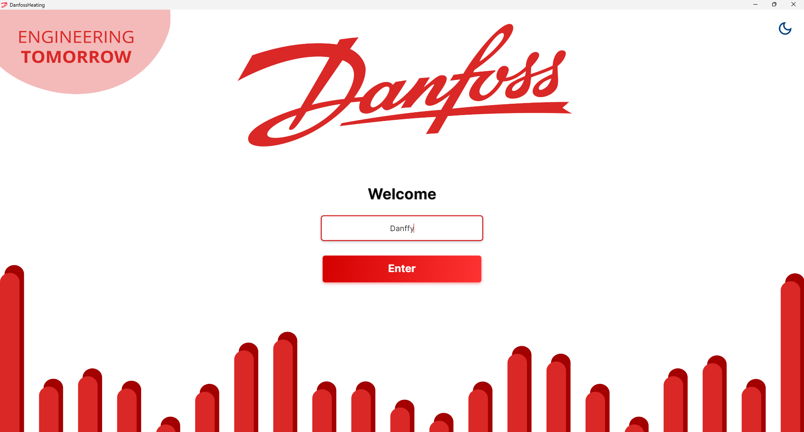
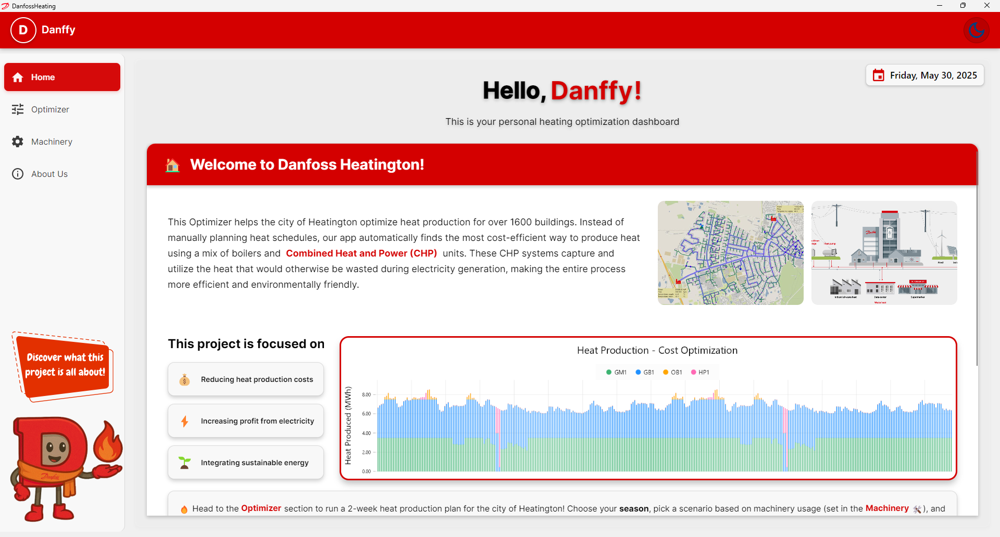
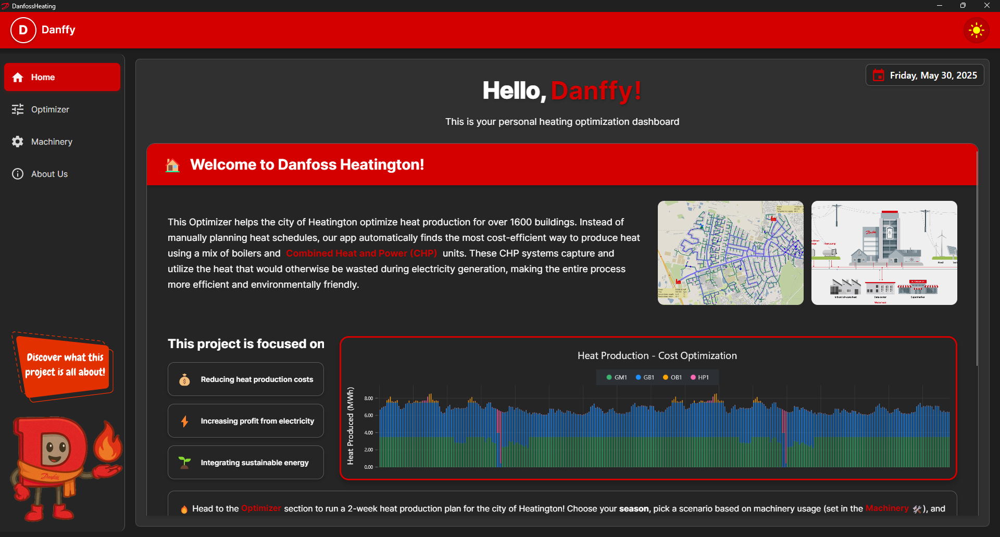
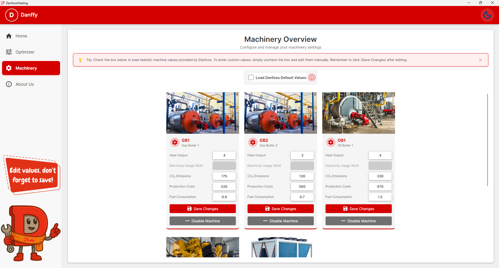
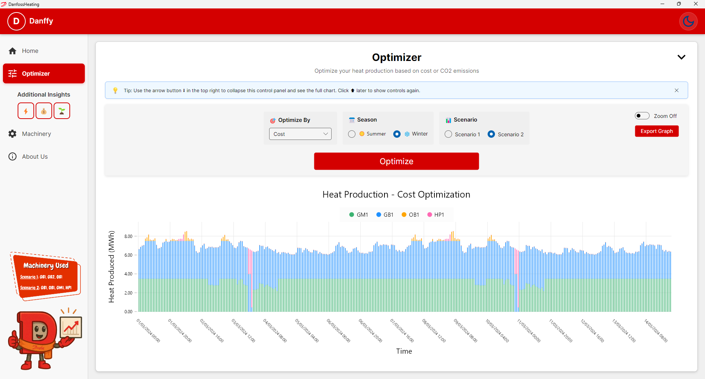
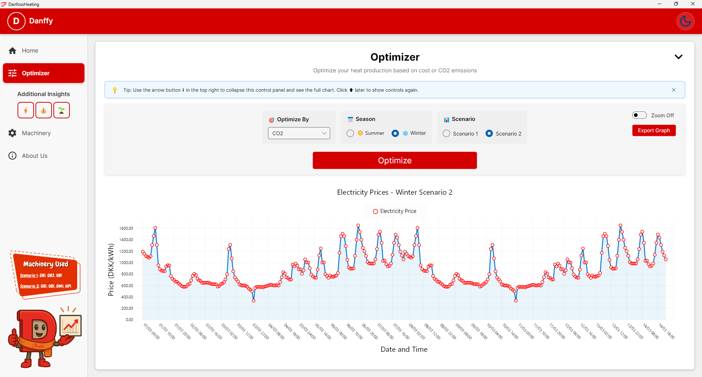
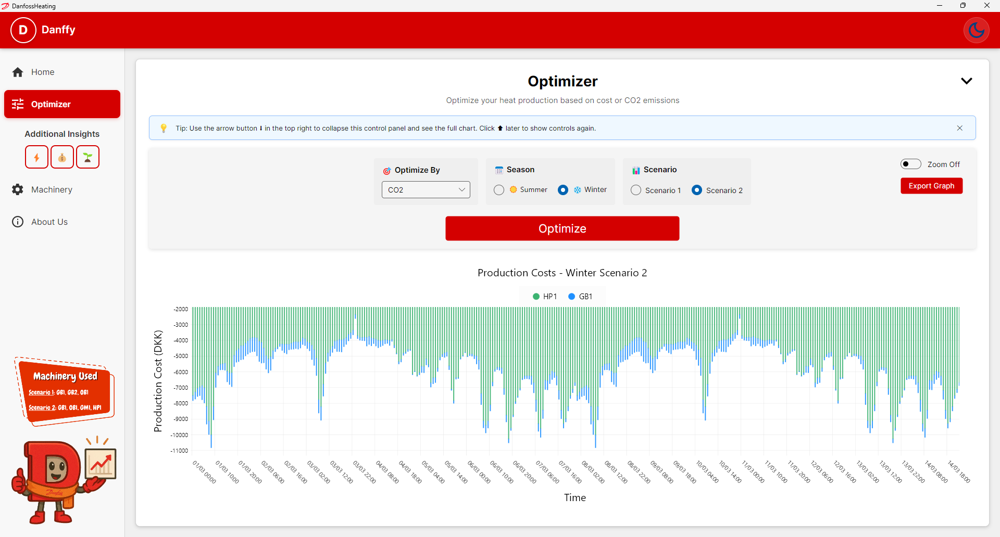
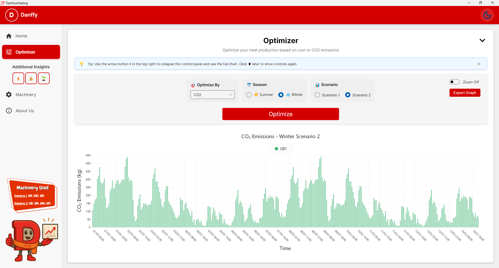

# 🔥 Danfoss: Heat Production Optimizer



**⚠️ Note for the Reviewer:**
This application uses CSV and JSON files in the `/Data` folder. You can test the optimization with sample data for heat demand and electricity prices.

## Project Overview

This app automates district heating schedules for the city of Heatington. It finds the cheapest way to meet heat demand while maximizing electricity market profits. Built with **Avalonia** for a modern UI and modular design for clear data flow.

## Getting Started

Run the application in two modes:

### GUI Mode
From the project root, run:
```bash
dotnet run
```
This starts the Avalonia-based graphical interface.

### Console Mode
From the project root, run:
```bash
dotnet run -- --term
```
This starts the original console-only version.

## Features

- **Cost Optimization**: Calculates the cheapest mix of heat units hour by hour.
- **Dark Mode**: Toggle between light and dark themes.
- **Downtime Management**: Enable or disable individual machines for maintenance.
- **Customizable Unit Settings**: Edit production values, costs, and limits for each machine.
- **Modules**:
  - **Asset Manager (AM)**: Static data for machines and grid layout.
  - **Source Data Manager (SDM)**: Time series for heat demand and electricity prices.
  - **Result Data Manager (RDM)**: Saves optimization results to CSV.
  - **Optimizer (OPT)**: Core logic for schedule generation.
  - **Data Visualization (DV)**: Graphs for demand, production, costs, and emissions.
- **Unit Testing**: Verifies that methods and modules work correctly. We wrote:
  - 4 tests for Asset Manager (AM)
  - 3 for Source Data Manager (SDM)
  - 3 for Optimizer (OPT)
  - 2 for Result Data Manager (RDM)
  - 2 for User Interface (UI)
  - 4 functional tests

## 📁 Project Structure

```plaintext
DanfossHeating/
├── Assets/
│   ├── Danffy/          # UI screenshots
│   ├── Group3/          # Team photos
│   ├── Machines/        # Unit images
│   └── README/          # Images referenced by README
├── Converters/          # Data converters for UI
├── Data/                # CSV and JSON data files
├── Models/              
│   ├── AssetManager/    
│   ├── Optimizer/       
│   ├── ResultDataManager/
│   └── SourceDataManager/
├── ViewModels/          # UI logic
├── Views/               # UI layouts
├── Program.cs           # Entry point
└── README.md            # This file

DanfossHeatingTests/
├── AssetManagerTests.cs
├── OptimizerTests.cs
├── ResultDataManagerTests.cs
├── SourceDataManagerTests.cs
└── UITests.cs
```

## 👥 Contributors

| Name | GitHub Profile |
|------|----------------|
| **Luigi** | [Lucol24](https://github.com/Lucol24) |
| **Carolina** | [chaeyrie](https://github.com/chaeyrie) |
| **Gabriele** | [Gabbo693](https://github.com/Gabbo693) |
| **Lara** | [Lara-Ghi](https://github.com/Lara-Ghi) |
| **Mats** | [mqts241](https://github.com/mqts241) |
| **Manish** | - |

### Responsibility Breakdown

- **AM:** Manish, [Luigi](https://github.com/Lucol24), [Carolina](https://github.com/chaeyrie)
- **OPT:** Manish, [Gabriele](https://github.com/Gabbo693), [Mats](https://github.com/mqts241)
- **SDM:** Manish, [Gabriele](https://github.com/Gabbo693), [Lara](https://github.com/Lara-Ghi)
- **RDM:** Manish, [Gabriele](https://github.com/Gabbo693), [Carolina](https://github.com/chaeyrie), [Luigi](https://github.com/Lucol24), [Lara](https://github.com/Lara-Ghi)
- **DV:** [Carolina](https://github.com/chaeyrie), [Luigi](https://github.com/Lucol24), [Lara](https://github.com/Lara-Ghi), [Gabriele](https://github.com/Gabbo693), [Mats](https://github.com/mqts241), Manish
- **Unit Testing:** [Gabriele](https://github.com/Gabbo693), [Mats](https://github.com/mqts241), [Luigi](https://github.com/Lucol24), Manish, [Lara](https://github.com/Lara-Ghi), [Carolina](https://github.com/chaeyrie)
- **UML Diagram:** [Mats](https://github.com/mqts241)

---

## How to Run

1. **App:** Open a terminal in the `DanfossHeating` folder and run:

   ```bash
   dotnet run
   ```

2. **Tests:** Open a terminal in `DanfossHeatingTests` and run:

   ```bash
   dotnet test
   ```

---

## 📊 Scenarios

- **Scenario 1:** Two gas boilers and one oil boiler.
- **Scenario 2:** Gas boiler, oil boiler, gas motor (produces electricity), and heat pump (consumes electricity).

---

## Screenshots & Assets

Below is a quick visual tour of the app’s main features:

- **Welcome Page**  
  

- **Home Page**  
  

- **Dark Mode Overview**  
  

- **Machinery Configuration**  
  

- **Optimizer Schedule Flow**  
  

- **Electricity Prices**  
  

- **Production Cost Overview**  
  

- **CO₂ Emissions Chart**  
  
